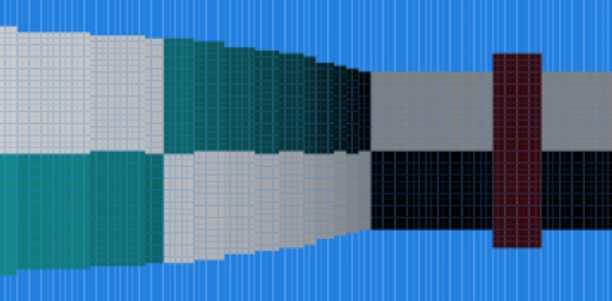

# Basic Haskell Raycaster with texture support

As described, this is a basic raycasting 3D """game engine""" written in Haskell using codeworld.

Rendering textures absolutely tanks performance - to enable or disable this feature, please uncomment / recomment the larger function definition of "makeActualLine" in View.

By default this is on, but it's much better to turn it off in terms of performance.

Most parameters can be edited. HorizontalResolution, VerticalResolution, HorizontalFieldOfView and ViewDistance are the easiest engine variables to change.

To change the map or textures, there's a texture atlas in Model.hs, and a map stored. Walls with textures must address an element in this atlas, where more commonly used textures come before less common ones (for performance reasons).

Similarly, the most prevalent colour in a texture should be on top.

Otherwise I think most of the code is reasonably self-explanetory. 99% of the important stuff is in View.hs.